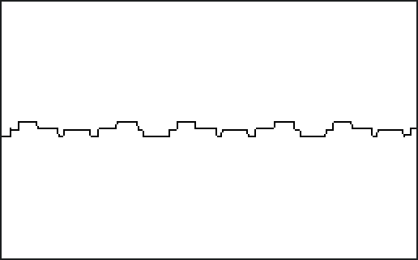

oso
===

A tiny, hackable osciiloscope for jack.

Somehow I can't find an software oscilloscope with a clean
UI and bright background, so I wrote one for myself.

oso has only one feature, and that is to display audio
waveforms in real time.

I rather intentionally chose to use a software framebuffer
for rendering, so it should be pretty easy to add new
features such as anti-aliasing, labels, etc. and interop
with cairo.

Currently, oso uses SDL for rendering the framebuffer, but
it should be trivial to port it to other backends such as
curses and linux fbdev because we are using a software 
framebuffer.

Usage
-----

Before running oso, make sure your JACK server is running
using `jackd` or `qjackctl`. Then run

    $ oso

on the command-line to open oso. A white window should pop
up. 

You need to connect the input of oso to the audio output 
of another application (for qjackctl, use the `Graph` or 
`Connect` button)

    +-------+--------+       +-----+-----------+
    | synth |        |       | oso |           |
    +-------+        |       +-----+           |
    |                |       |                 |
    |      audio_out +------>+ in              |
    +----------------+       +-----------------+

You can use command-line arguments to set the window size
and pixel scaling of oso:

    $ oso -W512 -H401 -S1

You can use `-` and `=` key to change the time scaling of
the oscilloscope and and `[` and `]` key to change the
amplitude scaling.

See `oso(1)` for details.

Build
-----

First, make sure jack and sdl2 are installed. For Arch-based
distros, use

    $ pacman -S jack2 sdl2

and for Debian-based distros, use

    $ apt-get install libjack-jackd2-dev libsdl2-dev

If you are on Windows, use MinGW.

Then use 

    $ ./configure
    $ make
    # make install

to build and install oso to your system.

Planned feature
---------------

- resampling for < 1 samples per pixel rendering
